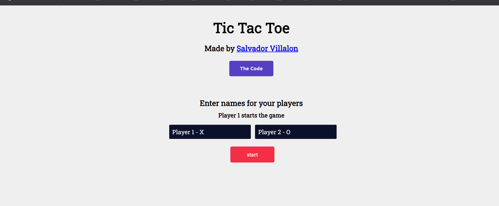

# Tic Tac Toe
[The Odin Project: Javascript] - Project: Tic Tac Toe

# Summary
Making a Tic Tac Toe game you can play in your browser!
- Project Task: [The Odin Project - Tic Tac Toe](https://www.theodinproject.com/lessons/node-path-javascript-tic-tac-toe)
- View Project: https://salvillalon45.github.io/theOdinProject-TicTacToe/

### Implementation 
- Used HTML, CSS, and JavaScript to complete application
- Implemented JavaScript factory functions to organize 

### Demo

### 📗 Fonts used

-   [Roboto Slab](https://fonts.google.com/specimen/Roboto+Slab?query=Roboto+Slab)
-   [Sen](https://fonts.google.com/specimen/Sen)

# Technologies:
  - HTML
  - CSS
  - JavaScript
